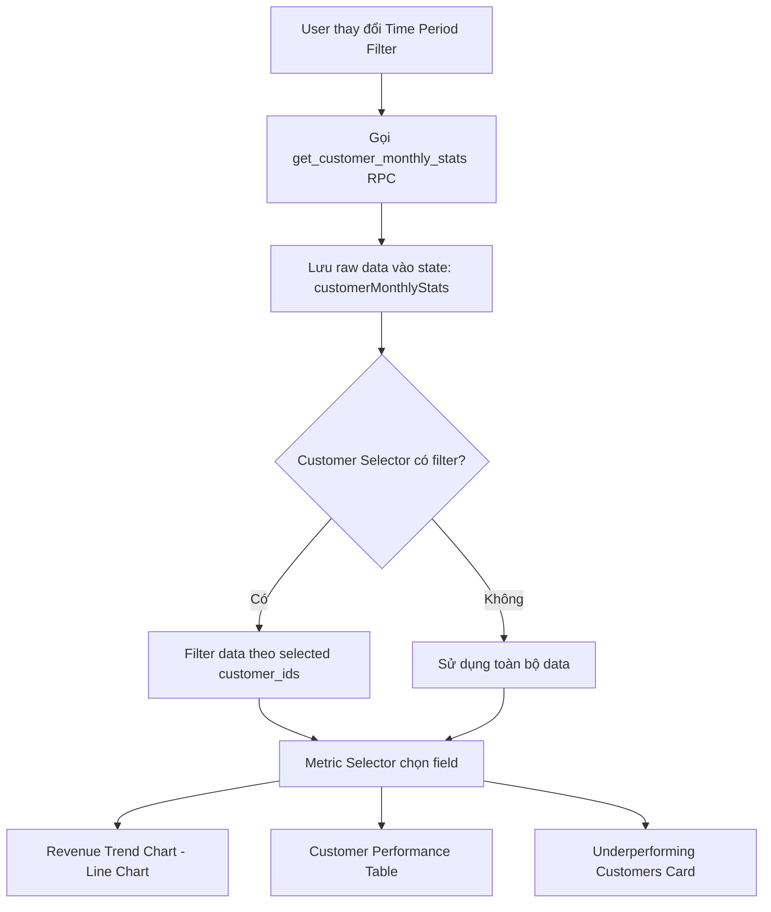
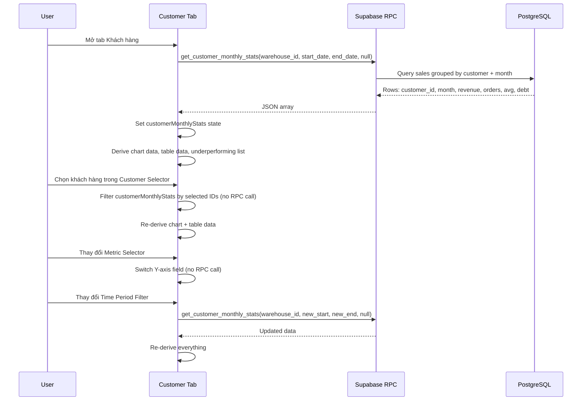
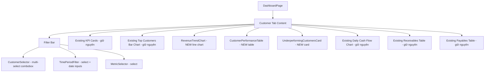

# Design Document: Customer Analytics Dashboard

## Overview

Tính năng này mở rộng tab "Khách hàng" trong trang `/dashboard` hiện tại, thay thế biểu đồ tròn "Cơ cấu công nợ phải thu" bằng các công cụ phân tích nâng cao. Thêm 3 bộ lọc (Customer Selector, Time Period Filter, Metric Selector), biểu đồ đường xu hướng theo tháng, bảng phân tích hiệu quả khách hàng, và card cảnh báo khách hàng cần hỗ trợ.

Dữ liệu được cung cấp bởi một Supabase RPC mới `get_customer_monthly_stats` trả về dữ liệu gom nhóm theo tháng cho từng khách hàng. Toàn bộ logic lọc, tính toán xu hướng, và phân trang được xử lý client-side từ dữ liệu RPC trả về.

### Quyết định thiết kế chính

1. **Một RPC duy nhất**: Thay vì tạo nhiều RPC riêng cho từng biểu đồ, sử dụng `get_customer_monthly_stats` trả về đủ dữ liệu (revenue, orders, avg_order_value, outstanding_debt) để phục vụ tất cả metric. Client-side sẽ chọn field phù hợp dựa trên Metric Selector.

2. **Client-side filtering**: Customer Selector lọc dữ liệu trên client từ kết quả RPC (đã có customer_id). Không cần gọi lại RPC khi thay đổi customer filter — chỉ cần gọi lại khi thay đổi date range.

3. **Tích hợp vào dashboard hiện tại**: Thêm state và logic mới vào `app/dashboard/page.tsx` thay vì tạo page riêng. Tab "Khách hàng" đã tồn tại, chỉ cần thay thế nội dung bên trong.

4. **Giữ nguyên các component hiện có**: KPI cards, top customers bar chart, daily cash flow chart, receivables/payables tables được giữ nguyên. Chỉ xóa pie chart "Cơ cấu công nợ phải thu" và thêm các component mới.

## Architecture

### Luồng dữ liệu tổng thể



### Luồng dữ liệu chi tiết



## Components and Interfaces

### Component Hierarchy



### Vị trí trong tab Khách hàng (từ trên xuống)

1. **Filter Bar** (Customer Selector + Time Period Filter + Metric Selector)
2. **KPI Cards** (giữ nguyên: Tổng công nợ, Tiền thu trong kỳ, Số KH mua)
3. **Top Customers Bar Chart** (giữ nguyên) + **Revenue Trend Chart** (MỚI) — grid 2 cột
4. **Customer Performance Table** (MỚI)
5. **Underperforming Customers Card** (MỚI)
6. **Daily Cash Flow Chart** (giữ nguyên)
7. **Receivables Table + Payables Table** (giữ nguyên)

> Biểu đồ tròn "Cơ cấu công nợ phải thu" bị XÓA.

### TypeScript Interfaces

```typescript
// Dữ liệu trả về từ RPC get_customer_monthly_stats
interface CustomerMonthlyStat {
  customer_id: string
  customer_name: string
  month: string          // DATE dạng 'YYYY-MM-01'
  monthly_revenue: number
  monthly_orders: number
  monthly_avg_order_value: number
  monthly_outstanding_debt: number
}

// Metric options cho Metric Selector
type MetricKey = 'revenue' | 'orders' | 'avg_order_value' | 'debt'

interface MetricOption {
  value: MetricKey
  label: string           // Vietnamese label
  yAxisLabel: string      // Label cho trục Y
  formatValue: (v: number) => string  // Format cho tooltip
}

// Dữ liệu đã transform cho Line Chart
interface TrendChartDataPoint {
  month: string           // 'T1', 'T2', ... 'T12'
  monthDate: string       // 'YYYY-MM-01' cho sorting
  [customerName: string]: number | string  // dynamic keys per customer
}

// Dữ liệu cho Customer Performance Table
interface CustomerPerformance {
  customer_id: string
  customer_name: string
  total_revenue: number
  total_orders: number
  avg_order_value: number
  outstanding_debt: number
  trend: 'up' | 'down' | 'stable'
  trend_pct: number       // % change from average
}

// Customer option cho Customer Selector
interface CustomerOption {
  value: string           // customer_id
  label: string           // customer_name
}

// Time period preset
interface TimePeriodPreset {
  value: string
  label: string
}
```

### Filter Bar Props & Behavior

**CustomerSelector:**
- Input: danh sách customers từ `customerMonthlyStats` (deduplicated)
- Output: `selectedCustomerIds: string[]`
- Behavior: multi-select combobox với search, badge count, clear button
- Sử dụng `cmdk` (đã có trong package.json) + Popover pattern

**TimePeriodFilter:**
- Presets: "Tháng này", "Tháng trước", "3 tháng" (default), "6 tháng", "Năm nay", "Tuỳ chọn"
- Output: `{ startDate: string, endDate: string }`
- Khi thay đổi → trigger RPC call mới

**MetricSelector:**
- Options: "Doanh thu" (default), "Số đơn hàng", "Giá trị TB/đơn", "Công nợ"
- Output: `selectedMetric: MetricKey`
- Khi thay đổi → chỉ re-render chart (không gọi RPC)

## Data Models

### SQL Migration: `scripts/031_customer_monthly_stats_rpc.sql`

```sql
-- =============================================
-- StockFlowQTfood - Phase 31: Customer Monthly Stats RPC
-- Provides monthly aggregated customer analytics data
-- =============================================

CREATE OR REPLACE FUNCTION public.get_customer_monthly_stats(
  p_warehouse_id UUID,
  p_start_date DATE,
  p_end_date DATE,
  p_customer_ids UUID[] DEFAULT NULL
)
RETURNS TABLE(
  customer_id UUID,
  customer_name TEXT,
  month DATE,
  monthly_revenue NUMERIC,
  monthly_orders BIGINT,
  monthly_avg_order_value NUMERIC,
  monthly_outstanding_debt NUMERIC
)
LANGUAGE plpgsql
SECURITY DEFINER
SET search_path = public
AS $fn$
BEGIN
  RETURN QUERY
  SELECT
    s.customer_id,
    COALESCE(c.name, s.customer_name, 'Khách lẻ') AS customer_name,
    date_trunc('month', s.created_at AT TIME ZONE 'Asia/Ho_Chi_Minh')::date AS month,
    SUM(s.total_revenue) AS monthly_revenue,
    COUNT(s.id) AS monthly_orders,
    CASE
      WHEN COUNT(s.id) > 0
      THEN ROUND(SUM(s.total_revenue) / COUNT(s.id), 0)
      ELSE 0
    END AS monthly_avg_order_value,
    SUM(s.total_revenue - s.amount_paid) AS monthly_outstanding_debt
  FROM public.sales s
  LEFT JOIN public.customers c ON c.id = s.customer_id
  WHERE s.warehouse_id = p_warehouse_id
    AND s.status != 'CANCELLED'
    AND s.created_at::date >= p_start_date
    AND s.created_at::date <= p_end_date
    AND (
      p_customer_ids IS NULL
      OR array_length(p_customer_ids, 1) IS NULL
      OR s.customer_id = ANY(p_customer_ids)
    )
  GROUP BY s.customer_id, COALESCE(c.name, s.customer_name, 'Khách lẻ'),
           date_trunc('month', s.created_at AT TIME ZONE 'Asia/Ho_Chi_Minh')
  ORDER BY customer_name ASC, month ASC;
END;
$fn$;
```

### Cấu trúc dữ liệu trả về (ví dụ)

| customer_id | customer_name | month      | monthly_revenue | monthly_orders | monthly_avg_order_value | monthly_outstanding_debt |
|-------------|---------------|------------|-----------------|----------------|-------------------------|--------------------------|
| uuid-1      | Cửa hàng A    | 2025-01-01 | 15,000,000      | 12             | 1,250,000               | 2,000,000                |
| uuid-1      | Cửa hàng A    | 2025-02-01 | 18,000,000      | 15             | 1,200,000               | 1,500,000                |
| uuid-2      | Đại lý B      | 2025-01-01 | 8,000,000       | 6              | 1,333,333               | 500,000                  |

### Client-side Data Transformations

**1. Derive chart data từ raw stats:**
```
Input: CustomerMonthlyStat[] (filtered by selected customers)
→ Group by month
→ For each month, create object with customer names as keys
→ Output: TrendChartDataPoint[]
```

**2. Derive performance table từ raw stats:**
```
Input: CustomerMonthlyStat[] (filtered by selected customers)
→ Group by customer_id
→ For each customer: sum revenue, sum orders, calc avg, get latest debt
→ Calculate trend: compare last month revenue vs average of previous months
→ Sort by total_revenue DESC
→ Output: CustomerPerformance[]
```

**3. Derive underperforming list:**
```
Input: CustomerPerformance[]
→ Filter where trend === 'down'
→ Sort by trend_pct ASC (largest decline first)
→ Output: CustomerPerformance[] (subset)
```

### Trend Calculation Logic

```
lastMonthRevenue = revenue of the most recent month in the period
previousMonthsAvg = average revenue of all months except the last one

if previousMonthsAvg === 0:
  trend = 'stable'
else:
  changePct = ((lastMonthRevenue - previousMonthsAvg) / previousMonthsAvg) * 100
  if changePct < -20: trend = 'down'
  elif changePct > 20: trend = 'up'
  else: trend = 'stable'
```


## Correctness Properties

*A property is a characteristic or behavior that should hold true across all valid executions of a system — essentially, a formal statement about what the system should do. Properties serve as the bridge between human-readable specifications and machine-verifiable correctness guarantees.*

### Property 1: Customer search filtering is correct

*For any* list of customer names and *any* search string, the filtered result should contain exactly the customers whose name includes the search string (case-insensitive), and no customers whose name does not contain the search string should be included.

**Validates: Requirements 2.3**

### Property 2: Customer selection filters data correctly

*For any* set of `CustomerMonthlyStat[]` data and *any* subset of selected `customer_ids`, filtering the data by the selected IDs should produce a result where every entry has a `customer_id` present in the selected set, and no entries for non-selected customers are included. When the selected set is empty, all entries should be returned.

**Validates: Requirements 2.6, 5.3, 6.3**

### Property 3: Metric selection maps to correct data field

*For any* `CustomerMonthlyStat` record and *any* selected `MetricKey`, the value extracted for the chart Y-axis should equal the corresponding field: `'revenue'` → `monthly_revenue`, `'orders'` → `monthly_orders`, `'avg_order_value'` → `monthly_avg_order_value`, `'debt'` → `monthly_outstanding_debt`.

**Validates: Requirements 4.2, 4.3, 4.4, 4.5**

### Property 4: Trend calculation and underperforming classification

*For any* customer with a sequence of monthly revenue values (at least 2 months), the trend should be classified as:
- `'down'` if the last month's revenue is more than 20% below the average of all previous months
- `'up'` if the last month's revenue is more than 20% above the average of all previous months
- `'stable'` otherwise

And the underperforming customers list should contain exactly the customers with `trend === 'down'`, sorted by `trend_pct` ascending (largest decline first).

**Validates: Requirements 6.4, 6.5, 6.6, 6.7, 7.1, 7.4**

### Property 5: Performance table default sort order

*For any* set of `CustomerPerformance[]` data, the default table output should be sorted by `total_revenue` in descending order — i.e., for every consecutive pair of rows, the first row's `total_revenue` should be greater than or equal to the second row's `total_revenue`.

**Validates: Requirements 6.8**

## Error Handling

| Scenario | Handling |
|---|---|
| `get_customer_monthly_stats` RPC fails | Hiển thị error message trong card biểu đồ. Các component khác (KPI cards, existing charts) vẫn render bình thường vì dùng data từ RPC khác. |
| RPC trả về mảng rỗng | Hiển thị `<NoData />` component (đã có pattern trong dashboard). Bảng và card underperforming hiển thị message "Chưa có dữ liệu". |
| Customer Selector không có khách hàng nào | Hiển thị combobox rỗng với placeholder "Không có khách hàng". |
| Chỉ có 1 tháng dữ liệu (không đủ tính trend) | Trend mặc định là `'stable'` khi chỉ có 1 tháng. Underperforming card hiển thị message tích cực. |
| `previousMonthsAvg === 0` (khách hàng mới) | Trend mặc định là `'stable'` để tránh chia cho 0. |
| Network timeout / slow response | Loading skeletons hiển thị cho tất cả component mới. Sử dụng pattern `loading` state giống dashboard hiện tại. |

## Testing Strategy

### Unit Tests (Example-based)

Kiểm tra các scenario cụ thể:

- **Filter defaults**: Time Period Filter mặc định "3 tháng", Metric Selector mặc định "Doanh thu"
- **Preset date calculation**: Mỗi preset ("Tháng này", "Tháng trước", etc.) tính đúng start_date/end_date
- **Month label formatting**: Tháng 1 → "T1", Tháng 12 → "T12"
- **Empty states**: Không có data → hiển thị NoData, không có underperforming → hiển thị message tích cực
- **Pagination**: > 20 customers → hiển thị pagination controls
- **UI presence**: Tất cả required columns trong table, legend trong chart, badge count trong selector
- **Removed component**: Pie chart "Cơ cấu công nợ phải thu" không còn render

### Property-Based Tests

Sử dụng thư viện `fast-check` cho TypeScript. Mỗi property test chạy tối thiểu 100 iterations.

| Property | Test Description | Tag |
|---|---|---|
| Property 1 | Generate random customer names + search strings, verify filter correctness | `Feature: customer-analytics-dashboard, Property 1: Customer search filtering` |
| Property 2 | Generate random CustomerMonthlyStat[] + random customer_id selections, verify filtering | `Feature: customer-analytics-dashboard, Property 2: Customer selection filtering` |
| Property 3 | Generate random CustomerMonthlyStat + random MetricKey, verify field mapping | `Feature: customer-analytics-dashboard, Property 3: Metric-to-field mapping` |
| Property 4 | Generate random monthly revenue sequences, verify trend classification + underperforming list | `Feature: customer-analytics-dashboard, Property 4: Trend calculation` |
| Property 5 | Generate random CustomerPerformance[], verify sort order by total_revenue DESC | `Feature: customer-analytics-dashboard, Property 5: Performance table sort` |

### Integration Tests

- **RPC smoke test**: Gọi `get_customer_monthly_stats` với valid params, verify trả về đúng schema
- **RPC excludes cancelled**: Insert cancelled + non-cancelled sales, verify chỉ non-cancelled được tính
- **RPC customer_ids filter**: Gọi với specific customer_ids, verify chỉ trả về customers đó
- **RPC ordering**: Verify kết quả sorted by customer_name ASC, month ASC
- **End-to-end filter flow**: Thay đổi Time Period → verify RPC được gọi lại với dates mới
